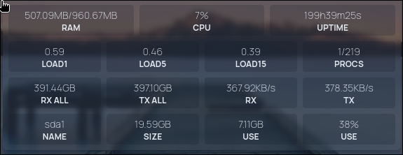

# fstmon

Monitoing microservice for [homepage](https://gethomepage.dev) or another. Written in 

## In Action




## Build

To build project in full prod variant
```sh
task build
```

For testing build
```sh
task run # builds anyway
```

## Arguments

## Command-line Options

| Option                               | Alias | Description                                             | Default     |
|--------------------------------------|-------|---------------------------------------------------------|-------------|
| `--log-level LOG-LEVEL`              |       | Logging level: `debug` \| `info` \| `warn` \| `error`   | `info`      |
| `--log-json`                         | `-j`  | Output logs in JSON format                              | `false`     |
| `--access-log ACCESS-LOG`            |       | Path to access log file: `file` \| `stdout` \| `none`   | `none`      |
| `--listen LISTEN`                    | `-l`  | Server listen address                                   | `:3000`     |
| `--certfile CERTFILE`                | `-c`  | TLS certificate file                                    | *(none)*    |
| `--keyfile KEYFILE`                  | `-k`  | TLS private key file                                    | *(none)*    |
| `--sni SNI`                          | `-h`  | Allowed request hosts (SNI)                             | `[]`        |
| `--subnets SUBNETS`                  | `-s`  | Allowed source subnets/IP addresses                     | `[]`        |
| `--token TOKEN`                      | `-t`  | Authentication token (env: `TOKEN`)                     | `[]`        |
| `--ip-header`                        |       | Enable parsing of reverse proxy IP headers              | `false`     |
| `--cpu-loop CPU-LOOP`                |       | CPU metrics update interval (seconds)                   | `10`        |
| `--memory-loop MEMORY-LOOP`          |       | Memory metrics update interval (seconds)                | `10`        |
| `--system-loop SYSTEM-LOOP`          |       | System metrics update interval (seconds)                | `20`        |
| `--thermal-loop THERMAL-LOOP`        |       | Thermal metrics update interval (seconds)               | `20`        |
| `--network-loop NETWORK-LOOP`        |       | Network I/O metrics update interval (seconds)           | `10`        |
| `--partitions-loop PARTITIONS-LOOP`  |       | Disk I/O metrics update interval (seconds)              | `10`        |
| `--help`                             | `-h`  | Display help and exit                                   | —           |

## Running

Homepage config:
```yml
// There will be your service config
          - type: customapi
            url: http://<host>:3300/monitoring/system
            method: GET
            refreshInterval: 10000
            mappings:
             - field: data.ram
               label: ram
               format: text
             - field: data.uptime
               label: uptime
               format: text
```

## License

[MIT](https://choosealicense.com/licenses/mit/)